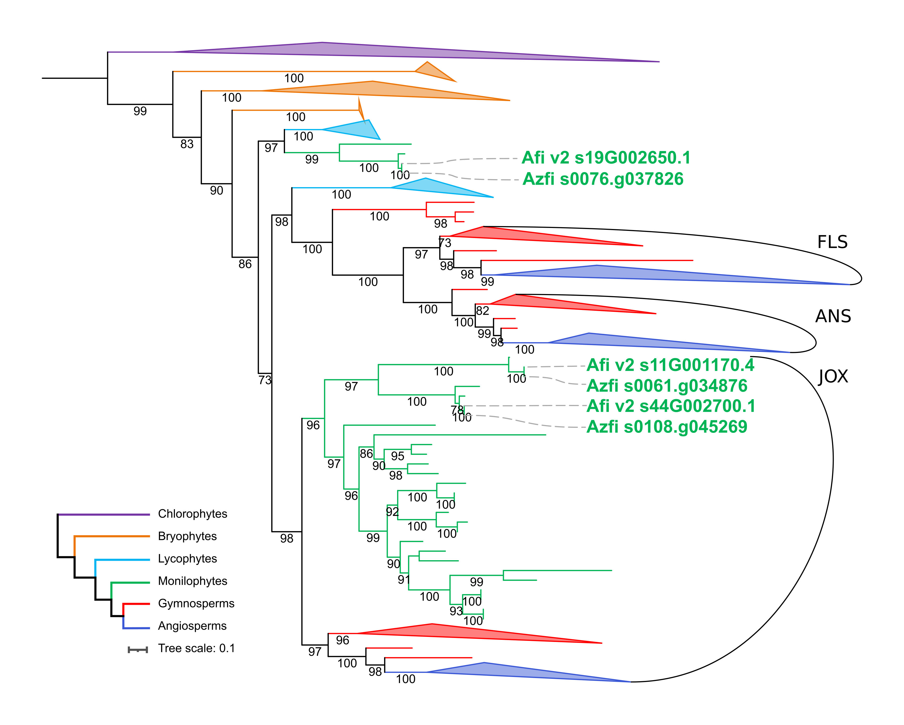

This repository contains a phylogentic analyses of the [2-OGD super family of enzymes](https://onlinelibrary.wiley.com/doi/10.1111/tpj.12479).
This work aims to place _Azolla filiculoides_ 2-OGD sequences in context of the broader evolution of this group, using data from the 1kP project.
Within this repository, all code, data, and most intermediate files are stored for reproducibility and documentation purposes.
The phylogeny created here is shown in Güngör et al. (in prep).

Quick links:
----------------------
Phylogeny of 2-OGD sequences in plants, firstly of the ANS, FLS and JOX subclades:
 *  [treefile](analyses/v2g5_JOX-ANS-FLS-subset_trees/aligned-mafft-einsi_trim-gt1_prank/v2g5_JOX-ANS-FLS-subset_aligned-mafft-einsi_trim-gt1_prank_iqtree-b200_booster.treefile) 
 * main text figure: 
 [png](figures/v2g5_JOX-ANS-FLS-subset_trees_transfer-bootstrap.png), 
 [pdf](figures/v2g5_JOX-ANS-FLS-subset_trees_transfer-bootstrap.pdf) & 
 [Inkscape_svg](figures/v2g5_JOX-ANS-FLS-subset_trees_transfer-bootstrap.svg)  

Secondly of the entire 2-OGD superfamily
* [treefile](analyses/orthogroup_AtLDOX_AT4g22880_selection-v2_guide-v5_trees/aligned-mafft-einsi_trim-gt3-res.50-seq99-supplmented/orthogroup_AtLDOX_AT4g22880_selection-v2_guide-v5_aligned-mafft-einsi_trim-gt3-res.50-seq99-supplmented_iqtree-bb1000-alrt1000.treefile)
* Supplemental figure: 
  [pdf](figures/v2g5_transfer_bootstrap.pdf) & 
  [Inkscape_svg](figures/v2g5_transfer_bootstrap.svg) 

Main text figure:
----------------------

Supplemental figure:
----------------------
View the [pdf](figures/v2g5_transfer_bootstrap.pdf) for all details.

## Guide through directories and files

### Directories
The `data` folder contains (unaligned) fasta files, lists of sequence names, and aligned sequences in both trimmed and untrimmed versions. 
File names tend to be long, but are meant to reflect the history of that specific file. 
For example: `orthogroup_AtLDOX_AT4g22880_selection-v2_guide-v5_aligned-mafft-einsi_trim-gt30.fasta` contains sequences from the 1kP orthogroup retrevied with LDOX from _Arabidopsis thaliana_ from which a manual selection was taken (v2). 
Second, several sequences were added (guide-v5), a set of guide sequences (sequences whose function has been verified), optionally some outgroup sequences, and _Azolla filiculoides_ sequences.
These sequences were then aligned with mafft-einsi and trimmed with trimAL settings `-gt .30`.

The `analyses` folder contains tree inferences. 
These are organised in folders of starting dataset, and then in folders of alignment and trimming strategy.
Still, a folder may contain several tree inferences made with IQTree. 
The final part of the filename summarises the settings used to create a particular tree file. 
Note that intermediate trees are just that, intermediate results. 

The `figures` folder contains the final versions of the figures shown in Güngör _et al_ (in prep). in several formats. 
These were made by importing a `.treefile` in [iToL](https://itol.embl.de/), then adding annotation manually, and downloading these as `.svg` file.
These `.svg` files were then finalised in Inkscape to their published form and exported as pdf or png. 

### Files
The workflows for which data is shared here, are documented in JuPyter notebooks (`*.ipynb`).
The workflow describing the final version of the complete tree is [2OGD_tree_v5](2OGD_tree_v5.ipynb). 
The workflow describing the final version of the subsetted tree is [v2g5_JOX-ANS-FLS-subset](v2g5_JOX-ANS-FLS-subset.ipynb). 
The other workflows are explorative and should be interpreted as such. 
A blank version of the workflow is maintained here: [Laura's phylogeny workflow](https://github.com/lauralwd/lauras_phylogeny_wf).
Note that figures which are embedded in the JuPyter notebooks are not properly displayed online on Github. 
You may download the `.ipynb` files to display them locally, including images. 

Finaly, the `environment.yaml` file details all software names and versions that were used in this project.
This file may be used to recreate the exact software environment for this analysis using [miniconda](https://docs.conda.io/en/latest/miniconda.html).
To do so, issue a command like so `conda env create -f ./environment.yaml`. 

## Data sources used in this project
In building these trees, we have made use of publicly available data, and a novel assembly and annotation of the _Azolla filiculoides_ genome (Azfi v2). 
_Azolla_ automated annotations (Afi v1) are available on [fernbase](ftp://ftp.fernbase.org/Azolla_filiculoides/Azolla_asm_v1.1/)
The novel assembly and annotation will be available publicly soon.
Sequences of relevance to this particular analysis are stored in [data/ANS-likes_Azolla-filiculoides_v4.fasta](data/ANS-likes_Azolla-filiculoides_v4.fasta).

Notably, we have made use of data made available by the [1000 plant transcriptomes project](https://sites.google.com/a/ualberta.ca/onekp/) (1kP).
First, we made use of the [1kP orthogroup extractor](http://jlmwiki.plantbio.uga.edu/onekp/v2/).
Unfortunately this website was taken offline shortly after publication of the 1kP project, and to the best of our knowledge the data is not accessible in any other manner. 
The orthogroups extracted by us are stored in this repository.
Second, we made use of the online [sample list viewer](http://www.onekp.com/samples/list.php) to create a subset of the orthogroup; taking care to sample across the tree of all plants with extra attention to seed-free plants. 
The subset used here is online in [google sheets](https://docs.google.com/spreadsheets/d/1v2igxY_nr7ETMoUdbqpY0QKVxJ-KYiRiO2lLoyOABsw/edit?usp=sharing), and the resulting lists are stored here in the `data` directory.

The 1kP project provides a wealth of sequencing information on taxa of plants for which few sequences are available from genome sequences, let alone sequences of which their function is verified. 
Therefore, we thankfully made use of the sequences collected in literature and online databases; 
most notably so in [Kawai _et al_. 2014: Evolution and diversity of the 2–oxoglutarate-dependent dioxygenase superfamily in plants](https://onlinelibrary.wiley.com/doi/10.1111/tpj.12479).
