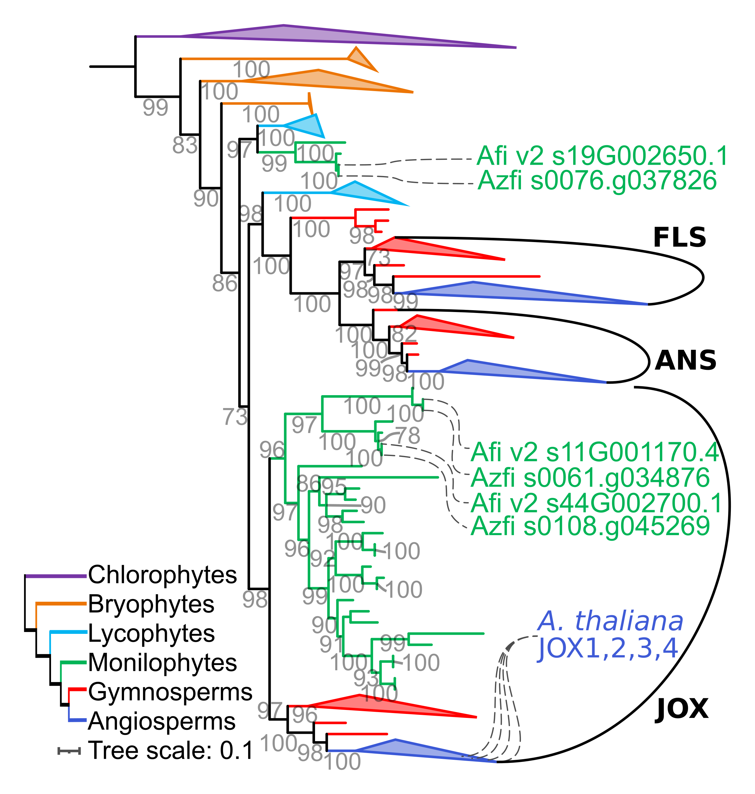

This repository contains a phylogentic analyses of the [2-OGD super family of enzymes](https://onlinelibrary.wiley.com/doi/10.1111/tpj.12479).
This work aims to place _Azolla filiculoides_ 2-OGD sequences in context of the broader evolution of this group, using data from the 1kP project.
Within this repository, all code, data, and most intermediate files are stored for reproducibility and documentation purposes.
The phylogeny created here is shown in Güngör et al. (in prep).

Quick links:
----------------------
Phylogeny of 2-OGD sequences in plants, firstly of the ANS, FLS and JOX subclades:
 *  [treefile](analyses/v2g5_JOX-ANS-FLS-subset_trees/aligned-mafft-einsi_trim-gt1_prank/v2g5_JOX-ANS-FLS-subset_aligned-mafft-einsi_trim-gt1_prank_iqtree-b200_booster.treefile) 
 * main text figure: 
 [png](figures/v2g5_JOX-ANS-FLS-subset_trees_transfer-bootstrap.png), 
 [pdf](figures/v2g5_JOX-ANS-FLS-subset_trees_transfer-bootstrap.pdf) & 
 [Inkscape_svg](figures/v2g5_JOX-ANS-FLS-subset_trees_transfer-bootstrap.svg)  

Secondly of the entire 2-OGD superfamily
* [treefile](analyses/orthogroup_AtLDOX_AT4g22880_selection-v2_guide-v5_trees/aligned-mafft-einsi_trim-gt3-res.50-seq99-supplmented/orthogroup_AtLDOX_AT4g22880_selection-v2_guide-v5_aligned-mafft-einsi_trim-gt3-res.50-seq99-supplmented_iqtree-bb1000-alrt1000.treefile)
* Supplemental figure: 
  [png](figures/v2g5_labels_at_tips.png),
  [pdf](figures/v2g5_labels_at_tips.pdf) & 
  [Inkscape_svg](figures/v2g5_labels_at_tips.svg) 

Main text figure:
----------------------

Supplemental figure:
----------------------

